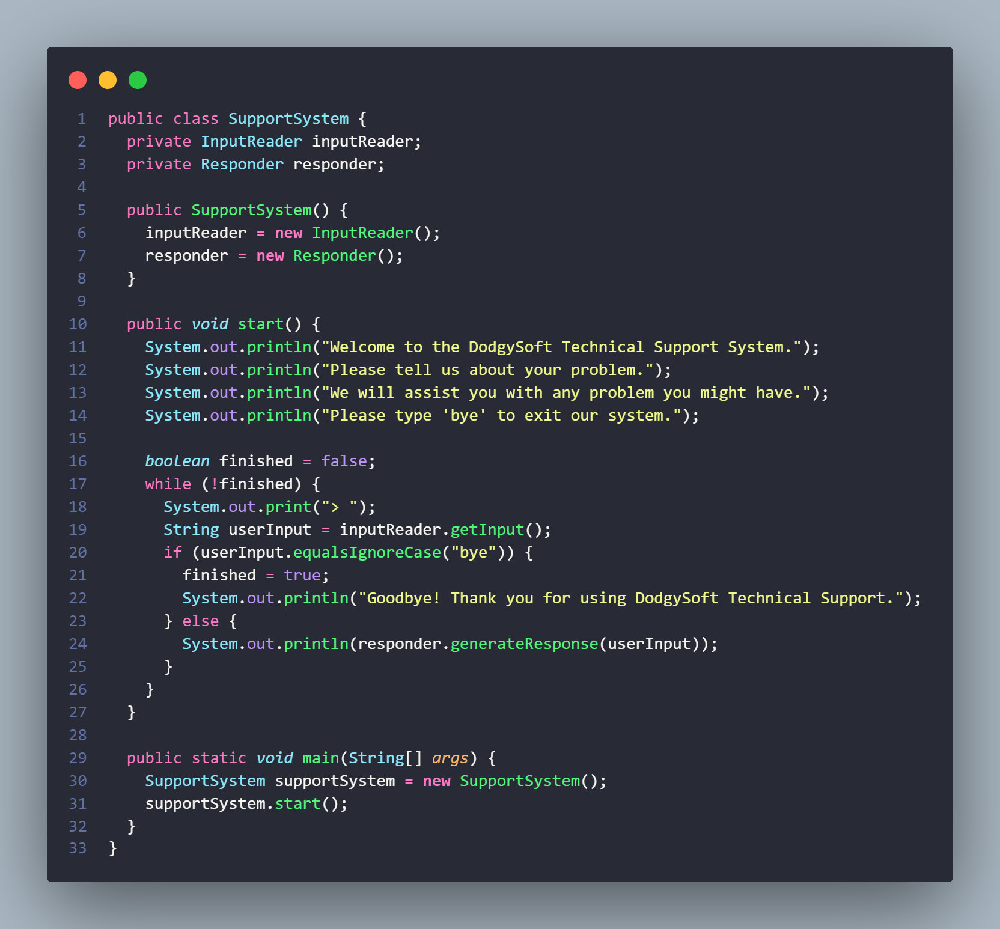

# **Studi Kasus Support System**

**Nama** : Adyuta Prajahita Murdianto

**NRP** : 5025221186

**Kelas** : PBO A

## **Class InputReader**

### **Fungsi**

Kelas bertugas untuk membaca input dari user. Kelas ini menggunakan salah satu utilitas dari java, yaitu `Scanner` sebagai scanner input dari user.

### **Atribut**

**scanner**

Atribut ini merupakan representasi dari scanner atau pembaca input dengan tipe data `Scanner`. 

### **Method**

**constructor**

Method ini berfungsi untuk menginisiasi value dari `scanner` dengan objek dari `Scanner` dengan parameter `System.in` agar bisa membaca input dari `command line`.

**getInput**

Berfungsi untuk membaca input dari user dengan mamnggil method `nextLine` pada `scanner` yang akan membaca input user hingga menemukan baris baru atau hingga user menekan tombol `enter` pada keyboard.

## **Class Responder**

### **Fungsi**

Berfungsi untuk merespon setiap input dari user. Kelas ini akan menggunakan utilitas `Map` sebagai interface atau tipe data, dan `HasMap` sebagai implementasi atau jenis `Map` nya. 

### **Atribut**

**keywordResponse**

Berfungsi sebagai tempat menyimpan seluruh response. Atribut ini menggunakan tipe data `Map`, karena setiap response yang disimpan akan memiliki `index` sesuai kata kunci atau keywordnya. 

### **Method**

**constructor**

Method ini berfungsi untuk menginisiasikan value dari atribut `keywordResponse` dengan objek `HashMap` kosong. Lalu kita memanggil method `initializeResponses` untuk mengisi `keywordResponse` dengan response-response untuk user beserta keywordnya.

**initializeResponses**

Method ini akan memasukkan setiap response-response yang akan diberikan untuk setiap input dari user beserta keywordnya, dengan memanggil method `put` pada `keywordResponse`. 

**generateResponse**

Berfungsi untuk memberikan response ke user dengan `userInput` sebagai parameter yang menyimpan input dari user. Pertama, input dari user akan kita jadikan `LowerCase` terlebih dahulu dengan memanggil method `toLowerCase`. Hal ini dilakukan karena setiap keyword dari response berformat `LowerCase`. Lalu dilakukan perulangan untuk menjelajahi setiap response yang tersimpan pada `keywordResponse` dan disetiap perulangannya akan dilakukan pengecekan apakah `userInput` mengandung kata yang cocok dengan salah satu `keyword`. Jika cocok, maka akan mengembalikan response sesuai dengan keywordnya. Jika sampai perulangan selesai tidak menemukan kecocokan dengan semua keyword, maka sistem akan merespon dengan `That sounds interesting. Tell me more...`.

## **Class SupportSystem**

### **Fungsi**

Kelas ini adalah kelas utama yang akan mengelola keseluruhan sistem. 

### **Atribut**

**inputReader**

Merupakan representasi dari pembacaan input yang bertipe data `InputReader`.

**responder**

Merupakan representasi dari pemberi respon yang bertipe data `Responder`

### **Method**

**constructor**

Berfungsi untuk menginisiai value dari atribut `inputReader` dengan objek dari kelas `InputReader` dan atribut `responder` dengan objek dari kelas `Responder`.

**start** 

Method ini digunakan untuk menjalankan keseluruhan sistem. Pertama method akan mengeluarkan kalimat-kalimat sambutan kepada user, serta insturksi untuk menghentikan program. Lalu disini akan menginisiasi variabel `finished` yang digunakan sebagai penanda apakah sistem sudah selesai digunakan atau belum, memiliki default value `false` yang menandakan bahwa sistem masih nyala dan sedang digunakan. Selanjutnya, kita melakukan perulangan yang akan berhenti ketika `finished` masih bernilai `false`. Untuk setiap perulangannya akan, akan mempersilahkan user untuk menginputkan keluhannya dengan memanggil method `getInput` pada `inputReader` yang value nya akan disimpan kedalam variabel bernama `userInput`. Lalu dilakukan pengecekan, apakah `userInput` mengandung kata `bye` yang berarti user sudah selesai menggunakan sistem. Jika iya, maka `finished` akan diganti valuenya menjadi `true` yang berarti akan menghentikan perulangan sehingga sistem akan mati dan akan memperlihatkan pesan penutupan. Namun jika tidak mengandung kata `bye`, maka sistem akan memberikan repsonse yang sesuai dengan keluhan yang diinputkan oleh `user` dan perulangan akan terus berlanjut untuk menangani keluhan-keluhan selanjutanya dari user.

**main**

Merupakan method utama dari program yang berfungsi untuk menjalankan program. Pertama kita akan membuat objek dari `SupportSystem` yang disimpan kedalam variabel `supportSystem`. lalu kita akan menjalankan sistem dengan memanggil method `start` pada `supportSystem`.

## **Hasil**

